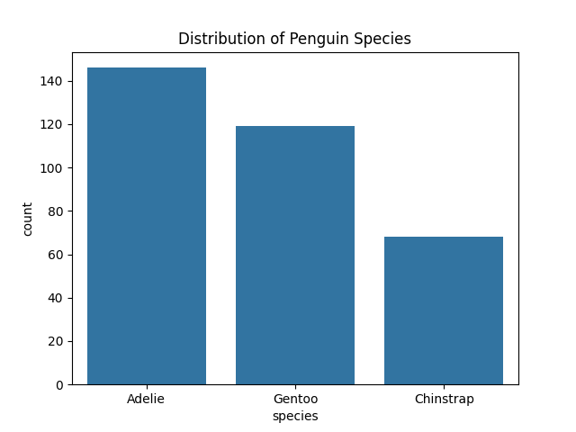
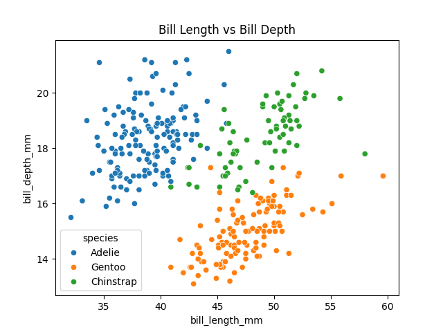
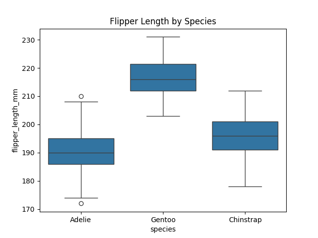
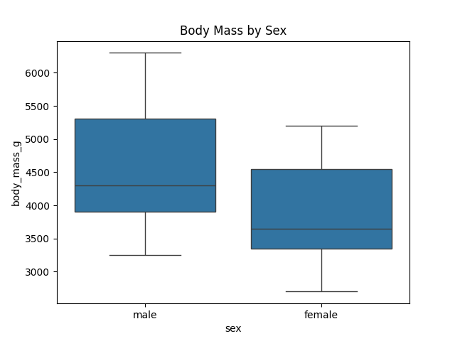
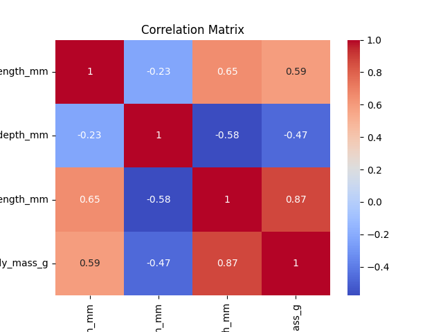
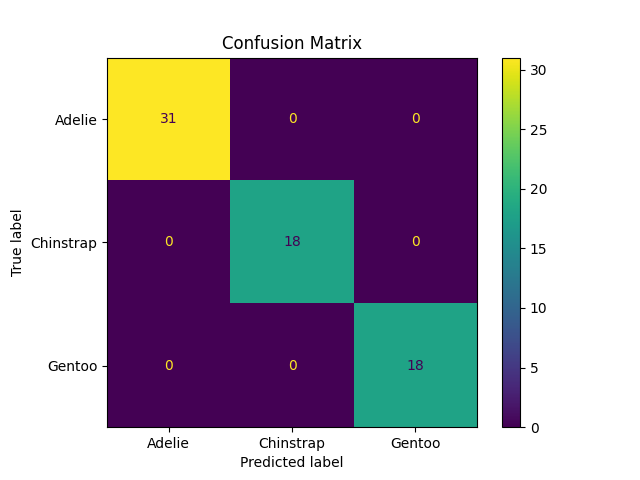

# Penguin Species Classification ✅

This repository runs a simple exploratory data analysis and a logistic regression classifier on the Palmer Penguins dataset.

## Results

**Accuracy:** 1.0

**Classes:** Adelie, Chinstrap, Gentoo

## Visualizations

---

## Dataset

This analysis uses the "Penguins Dataset for Visualization and M L" from Kaggle (ranaghulamnabi):

[Penguins Dataset for Visualization and M L](https://www.kaggle.com/datasets/ranaghulamnabi/penguins-dataset-for-visualization-and-m-l)

The file `penguins.csv` included in this repository was sourced from the dataset above.

